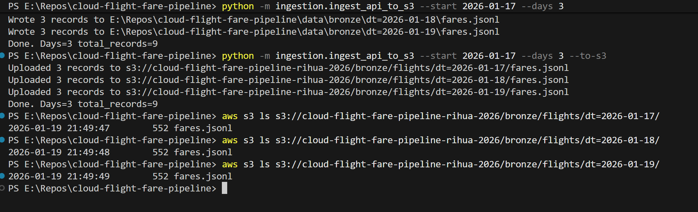
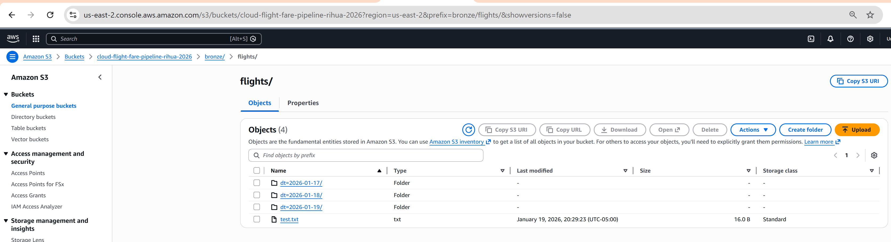

# Cloud Flight Fare Pipeline
**AWS • Airflow • Python • SQL • dbt • Redshift (prod) • Postgres (local demo)**

An end-to-end, **Data Engineering** pipeline with an **Analytics + (optional) Data Science** layer.

- **DE core:** ingest → bronze → transform → load → dbt marts → tests/docs → orchestration
- **DA layer:** example SQL queries + ready-to-chart mart tables
- **DS optional:** simple “Buy vs Wait” baseline model trained from mart features
---

## Quickstart (local demo in <10 minutes)

### Prereqs
- Python 3.11+
- Docker Desktop (running)
- dbt (installed in your venv)

### 1) Clone + env
```bash
git clone https://github.com/rihua-tech/cloud-flight-fare-pipeline.git
cd cloud-flight-fare-pipeline
python -m venv .venv
# Windows
.venv\Scripts\activate
pip install -r requirements.txt
```
### 2) Start Postgres (Docker)
```
docker compose up -d
```
### 3) Load sample data into Postgres
```
python scripts/load_sample_to_postgres.py
```
### 4) Run dbt (staging + marts + tests)
```
dbt build --project-dir dbt/flight_fares --profiles-dir dbt
```
### 5) Run analysis queries (proof queries)
```
python scripts/run_analysis_queries.py
```
### Verify tables exist (optional)
```
docker exec -it cloud-flight-fare-pipeline-postgres-1 psql -U fare_user -d fare_db -c "\dt marts.*"
```
###### Note: `dbt/profiles.yml` is ignored (credentials). Use `dbt/profiles.example.yml` as a template and create your own local `dbt/profiles.yml`.

✅ Then run:

```bash
git add README.md
git commit -m "Add Quickstart section"
git push

```

---

## Why this project (business story)
Travel apps and planners struggle with “**When should I book?**” because fares change by route, lead time, seasonality, and volatility.
This pipeline produces clean, tested tables that support:
- route/lead-time trends
- price alerts
- buy/wait recommendations

---

## Architecture (high level)
1) **Ingestion (Python):** API → S3 (bronze) OR local filesystem demo  
2) **Transform (Python or Spark):** bronze → parquet (silver)  
3) **Warehouse load (SQL/Python):** silver → Redshift (prod) or Postgres (local)  
4) **Modeling (dbt):** staging → star schema marts (dim/fact) + tests + docs  
5) **Analytics & DS:** example queries + optional baseline model

See: `docs/architecture.md`

---

## Repo structure
- `ingestion/` – API ingestion (Python) + local demo mode
- `transform/` – bronze → silver transforms (pandas) + optional `spark_jobs/`
- `warehouse/` – loaders + warehouse helpers (Postgres local / Redshift prod templates)
- `sql/` – DDL + COPY templates + analysis queries
- `dbt/flight_fares/` – staging + marts + tests + docs
- `airflow/` – DAG outline (how you’d orchestrate in production)
- `analytics/` – “proof” queries + quick EDA notes
- `ml/` – optional baseline buy/wait model
- `ci/` – GitHub Actions (lint + unit tests + dbt build)

---

## Local demo (runs without AWS)
### 0) Start Postgres
```bash
docker compose up -d postgres
```

### 1) Load sample data into `raw.fares`
```bash
pip install -r requirements.txt
python scripts/load_sample_to_postgres.py
```

### 2) Run dbt build (models + tests)
```bash
cp dbt/profiles.example.yml dbt/profiles.yml
dbt deps --project-dir dbt/flight_fares --profiles-dir dbt
dbt build --project-dir dbt/flight_fares --profiles-dir dbt
```

### 3) Run example analytics queries
```bash
python scripts/run_analysis_queries.py
```

### 4) (Optional) Train baseline model
```bash
python ml/train_buy_wait.py
```

---

## Production notes (AWS/Redshift)
- Redshift DDL/COPY templates: `sql/redshift/`
- Redshift dbt target setup (example only): `warehouse/redshift_dbt.md`
- Proof row counts after dbt: `sql/redshift/verify_marts.sql`
- Airflow DAG outline: `airflow/dags/flight_fare_pipeline_dag.py`
- Replace the local demo loader with:
  - API → S3 ingestion
  - Redshift COPY from S3
  - dbt runs in a job container / MWAA

---


## Week 3 — S3 Bronze Ingestion ✅

This step ingests daily fare snapshots and writes them to S3 in **bronze** partitioned folders.

### Command I ran (3 days)
```bash
python -m ingestion.ingest_api_to_s3 --start 2026-01-17 --days 3 --to-s3
```

### S3 path convention

Current Bronze layout (CSV):
```text
s3://<bucket>/bronze/dt=YYYY-MM-DD/fares.csv
```

*(Legacy note: an earlier version used `bronze/flights/.../fares.jsonl`. If your bucket still has that layout, keep using it — but the Week 4 Redshift COPY helper expects the CSV path above.)*


✅ Real examples (3 days):
- `s3://cloud-flight-fare-pipeline-rihua-2026-east1/bronze/dt=2026-01-22/fares.csv`
- `s3://cloud-flight-fare-pipeline-rihua-2026-east1/bronze/dt=2026-01-23/fares.csv`
- `s3://cloud-flight-fare-pipeline-rihua-2026-east1/bronze/dt=2026-01-24/fares.csv`

### Evidence (screenshots)
 (screenshots)

**Terminal output**


**S3 console folders**



## What recruiters should look at (fast)
- **DE:** `ingestion/`, `warehouse/`, `dbt/`, `sql/redshift/`, `ci/`
- **DA:** `dbt/…/marts/` + `sql/analysis/` + `analytics/`
- **DS:** `ml/` + feature query in `sql/analysis/buy_wait_features.sql`


## Week 4 — Warehouse target (S3 → Redshift Serverless → dbt) ✅

This repo can run against **Redshift Serverless** as a second “warehouse target” (in addition to local Postgres demo).

**High-level flow**
1) Bronze file exists in S3 (CSV)
2) Run warehouse SQL helper to reset schemas + create `raw.fares` + `COPY` from S3
3) Run dbt against the `redshift` target (staging + marts + tests)
4) Run proof queries in a SQL client (Query Editor v2 / DBeaver)

**Commands (PowerShell)**
```powershell
# (Optional) dry-run prints rendered SQL (no changes in Redshift)
python warehouse/run_redshift_sql.py --dry-run

# Executes: reset schemas + create raw table + COPY from S3
python warehouse/run_redshift_sql.py

# dbt connectivity check
dbt debug --project-dir dbt/flight_fares --profiles-dir dbt -t redshift

# build models + run tests
dbt build --project-dir dbt/flight_fares --profiles-dir dbt -t redshift
```

**Proof queries (run in a SQL client, not PowerShell)**
```sql
select count(*) from raw.fares;
select count(*) from marts.fact_fares;
select * from marts.dim_route limit 10;
```

See `docs/week4_redshift_runbook.md` for full steps + “no secrets committed” notes.


---
