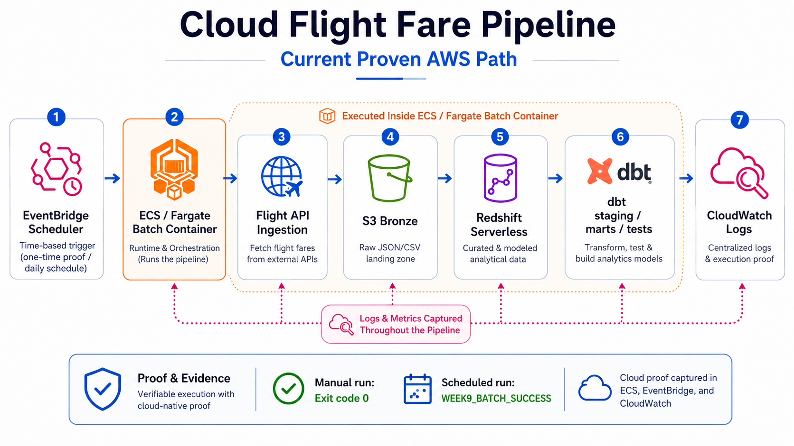

# Architecture

## Current Proven AWS Path

This repo's proven cloud path is:

```text
EventBridge Scheduler -> ECS / Fargate Batch Container -> Flight API Ingestion -> S3 Bronze -> Redshift Serverless -> dbt staging/marts/tests -> CloudWatch Logs
```



What was actually validated:

- EventBridge Scheduler triggered an ECS/Fargate task.
- ECS/Fargate ran the Docker batch container.
- The batch container ingested fare data into S3 Bronze.
- Redshift Serverless loaded Bronze CSV data into `raw.fares`.
- dbt built Redshift staging and mart models and ran tests.
- Mart verification completed.
- CloudWatch Logs showed `WEEK9_BATCH_SUCCESS` for manual and scheduled runs.

## Batch Container Flow

The batch container is the execution unit for the proven AWS path:

```text
Flight API -> S3 Bronze -> Redshift Serverless -> dbt staging/marts/tests
```

The container entrypoint is `scripts/run_aws_batch_pipeline.py`. It composes the
existing project commands instead of duplicating business logic:

- `python -m ingestion.ingest_api_to_s3 --mode s3`
- `python warehouse/run_redshift_sql.py`
- `dbt deps` and `dbt build` against the Redshift target
- `python warehouse/run_redshift_sql.py --files verify_marts.sql`

The dbt profile is generated at runtime from environment variables. Redshift
passwords are supplied through ECS Secrets Manager and are not committed.

## AWS Services Used

| Service | Role in the proven path |
|---|---|
| EventBridge Scheduler | Triggers the ECS/Fargate task |
| ECS / Fargate | Runs the Dockerized batch job |
| ECR | Stores the `week9` batch image |
| S3 | Stores partitioned Bronze CSV data |
| Redshift Serverless | Hosts raw, staging, and mart schemas |
| Secrets Manager | Supplies the Redshift password to ECS |
| CloudWatch Logs | Captures batch run logs and success markers |

## Data Model / Marts

| Mart | Grain | Main Use |
|---|---|---|
| `marts.fact_fares` | One observed fare per `snapshot_date`, `origin`, `dest`, and `depart_date` | Average fare, minimum fare, lead-time analysis, weekday/weekend analysis |
| `marts.dim_route` | One row per route (`origin`, `dest`) | Route slicing and route labels |
| `marts.dim_date` | One row per date | Calendar slicing by day, month, and year |

## Local Demo

The Local Demo is a development path that runs without AWS credentials. It is
secondary to the Current Proven AWS Path.

Execution flow:

```text
Local CSV/sample data -> local Postgres raw.fares -> dbt staging/marts/tests -> local analysis outputs
```

Run locally:

```bash
docker compose up -d postgres
python scripts/load_sample_to_postgres.py
dbt build --project-dir dbt/flight_fares --profiles-dir dbt
python scripts/run_analysis_queries.py
```

Reference conceptual diagram:


## Future Work

These are intentionally listed as future work, not completed cloud proof:

- Terraform / CloudFormation full IaC deployment
- MWAA or broader production orchestration expansion
- richer BI dashboard
- ML / buy-vs-wait extension
- monitoring and alerting improvements
- production hardening

## Proof Runbooks

- [Week 7: Real AWS Bronze S3 ingestion proof](runbooks/week7_s3_bronze_ingestion.md)
- [Week 8: S3 -> Redshift Serverless -> dbt proof](runbooks/week8_redshift_warehouse_proof.md)
- [Week 9: EventBridge Scheduler -> ECS/Fargate -> CloudWatch proof](runbooks/week9_ecs_fargate_scheduler_proof.md)

